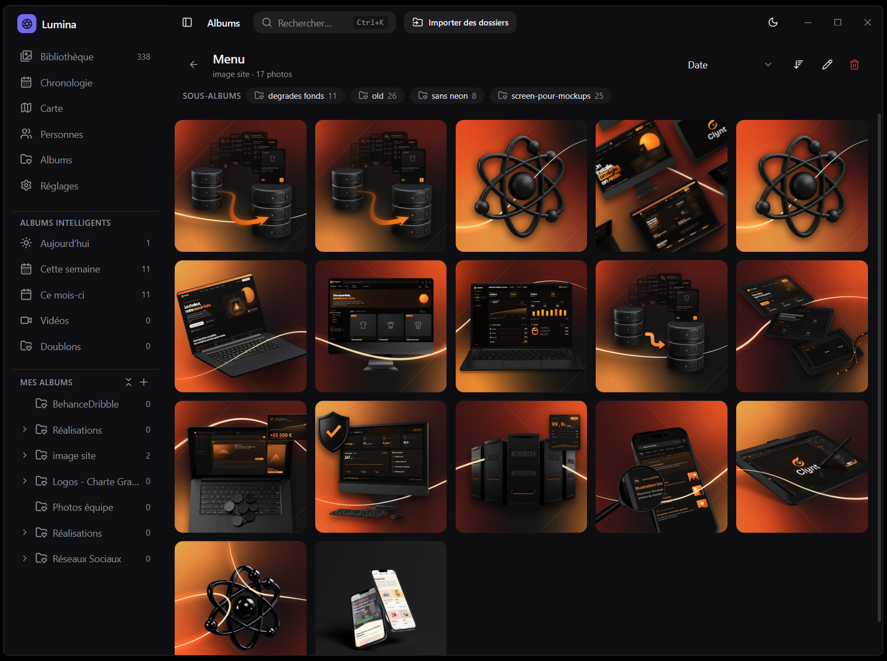

# Lumina

A fast, **local-first** modern photo library manager. Lumina is a clean-room alternative to
digiKam / Lightroom focused on library management, speed and a calm, spacious UI.
Everything runs on your machine. **No cloud, no telemetry, your files never leave
your disk, and originals are never modified.**

Built with **Tauri v2 (Rust)** + **React + TypeScript**. No Electron.



---

## Download

Grab the latest Windows installer from the
[**Releases**](https://github.com/Zakaru-Studio/lumina/releases/latest) page
(`Lumina_x.y.z_x64-setup.exe`). Windows 11 ships with the required WebView2
runtime; on older Windows the installer fetches it automatically.

Lumina **auto-updates**: on launch it quietly checks for a newer signed release
and, if one exists, offers to install and restart. You can also check manually
from **Settings → About → Check for updates**. Only updates whose signature
matches the key baked into the app are ever installed.

> Currently only **Windows** builds are published. macOS/Linux users can build
> from source (below).

---

## Highlights

- **Blazing library browsing** — virtualized grid stays fluid at 300k+ photos
  (TanStack Virtual + windowed queries + LRU thumbnail cache).
- **Background scan pipeline** — discovery → EXIF → thumbnail → database, each
  stage parallelized with Rayon; real-time progress, never a spinner.
- **Real-time folder watching** — new/changed/removed files are picked up
  automatically (non-destructively).
- **Rich metadata** — EXIF date, GPS, camera, lens, ISO, aperture, shutter,
  focal length, orientation.
- **WebP thumbnails** — generated once, cached permanently, sharded on disk,
  served zero-copy via the Tauri asset protocol.
- **Instant search** — SQLite **FTS5** over filename, folder, camera, lens, tags
  and color.
- **Timeline** — automatic grouping by day / month / year.
- **Smart albums** — Today, This Week, This Month, Favorites, RAW, Videos
  (dynamic, rule-driven), plus manual albums with drag & drop.
- **Tags, star ratings (0–5), color labels** — all non-destructive.
- **Keyboard-first** — ⌘/Ctrl+K global search, ⌘/Ctrl+A select all, Delete to
  remove from catalog (never deletes the file).
- **Light / dark / system** themes.
- **AI-ready architecture** — provider traits + storage tables for future CLIP,
  face recognition, OCR and vector search, with **no** models in the MVP.

---

## Tech stack

**Backend (`src-tauri/`)** — Rust, Tokio, Rayon, rusqlite (SQLite + WAL + FTS5),
`image` + `fast_image_resize`, `kamadak-exif`, `walkdir`, `notify`, `uuid`,
`anyhow`/`thiserror`, `tracing`, `lru`.

**Frontend (`src/`)** — React, TypeScript, Vite, Tauri v2, TanStack Query,
React Router, Zustand, Tailwind CSS, shadcn/ui, TanStack Virtual.

---

## Prerequisites

- **Node.js** ≥ 18 and npm
- **Rust** (stable) via [rustup](https://rustup.rs/)
- Tauri v2 system dependencies for your OS — see
  <https://v2.tauri.app/start/prerequisites/>
  (Windows: Microsoft C++ Build Tools + WebView2; macOS: Xcode CLT; Linux:
  webkit2gtk etc.)

## Getting started

```bash
# 1. Install frontend dependencies
npm install

# 2. (optional) regenerate placeholder app icons
node scripts/generate-icons.mjs

# 3. Run the app in development (starts Vite + Tauri)
npm run tauri:dev

# 4. Produce a distributable build
npm run tauri:build
```

Open the project folder directly in VS Code — recommended extensions are listed
in `.vscode/extensions.json` (rust-analyzer, Tauri, Tailwind).

### First run

1. Launch the app and click **Import** (sidebar) or open **Settings → Watched
   Folders → Add folder…**.
2. Pick one or more folders. Lumina scans them in the background, extracting
   metadata and generating thumbnails, and keeps watching them for changes.

Application data (the SQLite catalog and thumbnail cache) lives in your OS app-data
directory under `studio.zakaru.lumina`. The thumbnail cache location is
configurable in Settings.

---

## Architecture

```
src-tauri/src/
  core/        # error, domain models, config, query contracts, shared state
  database/    # r2d2 pool, migrations, repositories (photos/tags/albums/…)
  scanner/     # discovery → pipeline (Rayon) → db writer, + real-time watcher
  thumbnail/   # WebP generator (fast_image_resize) + on-disk cache + LRU
  metadata/    # EXIF extraction + format classification
  search/      # FTS5 index maintenance + query building
  events/      # typed event bus to the frontend
  ai/          # provider traits + storage (architecture only)
  api/         # thin Tauri commands (no business logic)

src/
  components/  # ui (shadcn), layout, library, command, common
  pages/       # Library, Timeline, Search, Albums, Settings
  hooks/       # TanStack Query + event hooks
  stores/      # Zustand (ui, selection, scan)
  lib/         # api boundary, query client, formatting, events, utils
  types/       # TypeScript mirror of the Rust data contract
```

**Design principles**

- The frontend contains **no business logic** — it only calls typed Tauri
  commands via `src/lib/api.ts`.
- The Rust code uses `Result` everywhere, a single `Error` type, structured
  `tracing` logs, and avoids `unwrap()` in production paths.
- Every long operation streams **progress** (events) and the UI shows
  **skeletons**, never loading spinners.
- All catalog operations are **non-destructive**; the scanner and watcher never
  write to your original files.

### The scan pipeline

```
Discovery (walkdir, diff vs catalog)
   → Index   (EXIF + dimensions + hash)   ┐ Rayon workers, in parallel
   → Thumbnail (decode → resize → WebP)   ┘
   → Database (single writer, batched transactions)   → events → UI
```

### AI (future)

`src-tauri/src/ai/` defines `EmbeddingProvider` and `RegionDetector` traits, an
`AiRegistry`, and the `ai_embeddings` / `ai_regions` tables already exist. Adding
CLIP search, face recognition or OCR is a matter of implementing a provider and
registering it at startup — no schema or API refactoring required.

---

## Testing

```bash
cd src-tauri
cargo test
```

Integration tests (`src-tauri/tests/integration.rs`) cover insert/list/count,
idempotent upsert, FTS search, ratings/favorites/soft-delete, the tag lifecycle
and smart-album resolution. Unit tests live alongside their modules.

---

## Supported formats

JPEG, PNG, WebP, GIF, TIFF, BMP (full decode + thumbnails). HEIC and RAW families
(CR2/CR3, NEF, ARW, DNG, ORF, RAF, RW2, …) are catalogued with a **minimal read**
(metadata only) in the MVP; full decode/thumbnailing is a future enhancement (see
the `heic` cargo feature stub). Video is architected but not implemented.

---

## Releasing (maintainers)

Releases are cut **locally** from a Windows machine with one command. The build
produces a **signed** NSIS installer and an updater manifest (`latest.json`);
the GitHub Release hosts both, and installed apps pick up the update from
`releases/latest/download/latest.json`.

**One-time setup**

1. Install and authenticate the GitHub CLI: `gh auth login`.
2. Generate the updater signing keypair (once, ever):
   ```bash
   npx tauri signer generate -w "$USERPROFILE/.tauri/lumina.key"
   ```
   Put the **public** key in `src-tauri/tauri.conf.json`
   (`plugins.updater.pubkey`) — this ties every future update to your key.
3. Create a **gitignored** `.env.release` at the repo root with the private-key
   path and its password (never commit these):
   ```ini
   LUMINA_SIGNING_KEY_PATH=C:\Users\you\.tauri\lumina.key
   TAURI_SIGNING_PRIVATE_KEY_PASSWORD=your-key-password
   ```

**Cutting a release**

```bash
node scripts/release.mjs 0.2.0 "What changed in this version"
```

This validates a clean tree + auth + signing, bumps the version everywhere,
builds and signs the installer, writes `latest.json`, commits, tags `v0.2.0`,
pushes, and creates the GitHub Release with the installer + manifest attached.

Inside Claude Code you can run the same flow with **`/release 0.2.0 "notes"`**.

> The signing **private key** and its password are the only things that let you
> publish an update users will accept. Keep them safe and off the repo. Losing
> the key means shipping a new pubkey (and a non-updating transition build).

---

## License

Lumina is free software licensed under the **GNU General Public License v3.0**
(GPL-3.0-only). You may use, study, share and modify it; distributed derivative
works must remain under the GPL. See [LICENSE](LICENSE) for the full text.

Copyright © Zakaru Studio.
